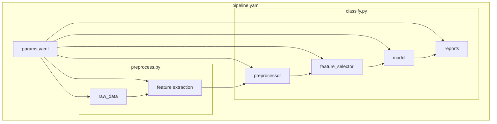

1. Install packages. `python -m pip install -r requirements.txt`

2. Run `dvc pull && dvc repro` to train the default model according to the pipeline outlined in `dvc.yaml`. To view an outline of the graph run `dvc dag`
Folders and filenames are specified in `params.yaml`. Model input parameters are in `params.yaml`. Parameters are saved in `configs/`. Scores, plots, and a static site are available in `results/`.

feature-selection
3. Note that you can also change the name of the model since the classify.py has a function that will load an arbitrary object of type `model` with initialization keyworks written as an in-order list in `params`. You can optionally inlcude more preprocessor/transormers by adding an entry to the `params.yaml` file, similar to `preprocessor` `feature_selector`, or `model`. Remember to add that entry to the pipeline list in the same file to specify the execution order. You can load any library that implements the `fit()` and `predict()` methods for the model. Preprocessors must have `fit` and `transform` as per the `scikit-learn` api. This should work with any such object, though the plots are only guaranteed to work with `sklearn`. For more information on the plots, [see:](https://www.scikit-yb.org/en/latest/api/contrib/wrapper.html).
The basic experiment pipeline is here:


DVC docs are [here](https://dvc.org).

```bash driver.sh``` pull in the data, display the pipeline, run an experiment, render the results, and start a server on port `8000`.
